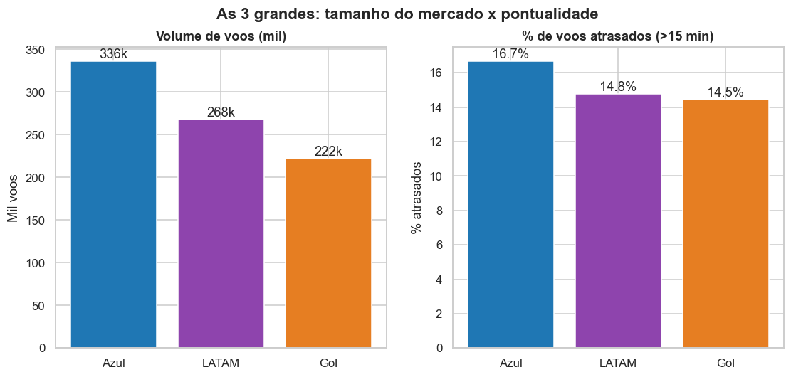
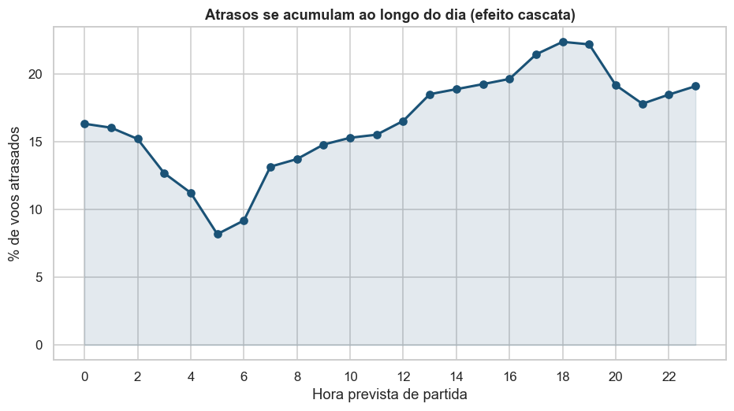
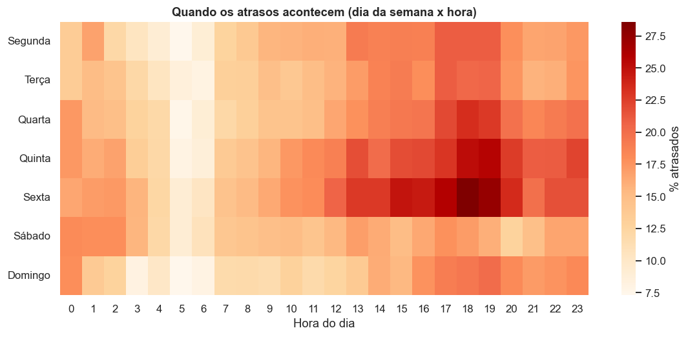
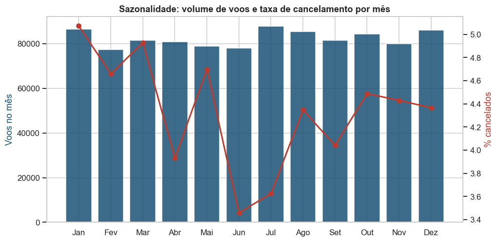
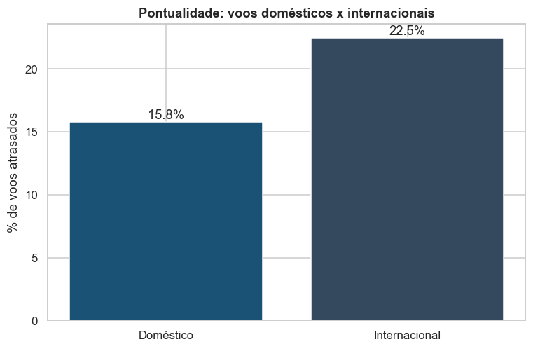
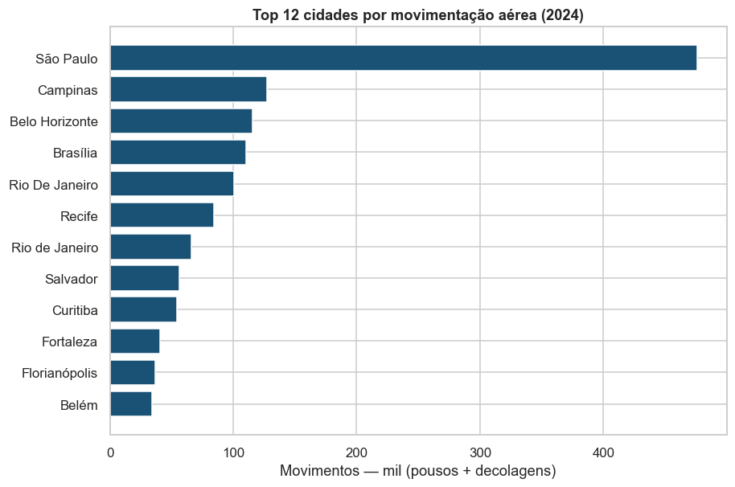
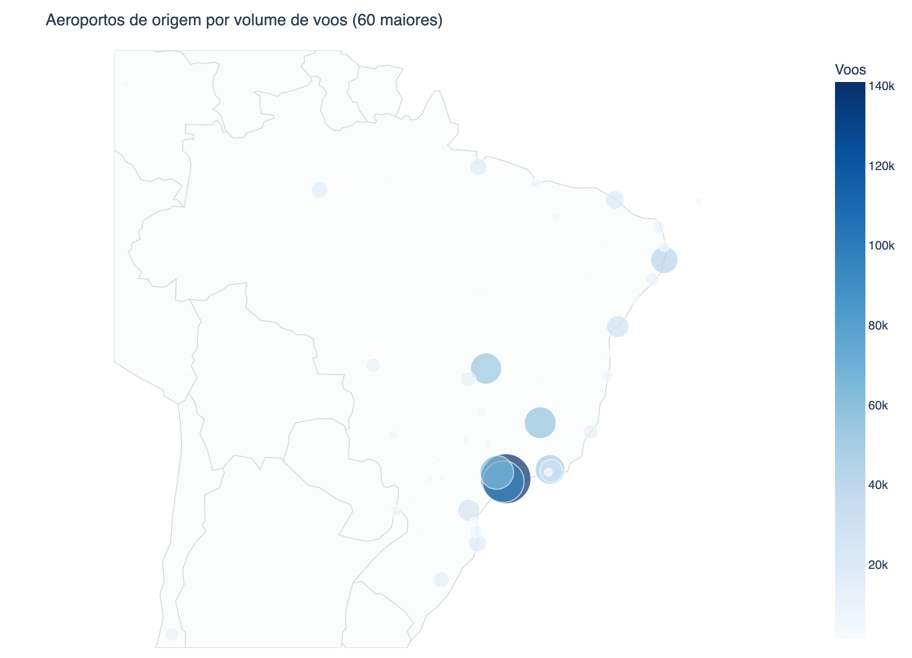
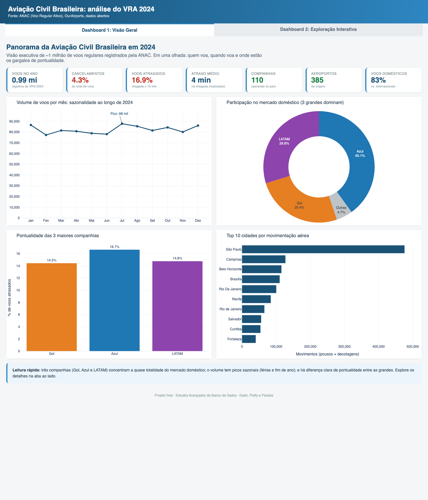
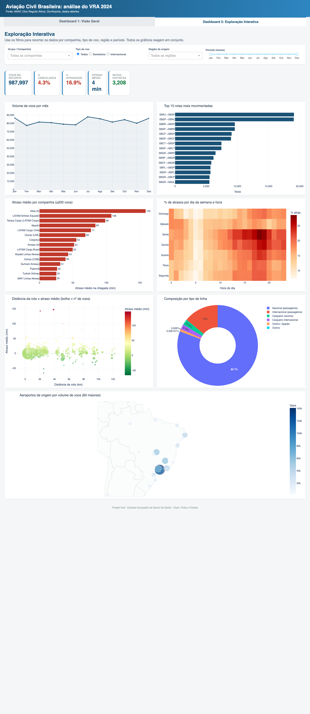

# Aviação Civil Brasileira em 2024
### Relatório do projeto final (Estudos Avançados de Banco de Dados)

> Fonte principal: ANAC, Voo Regular Ativo (VRA), ano de 2024.
> Volume analisado: cerca de 988 mil voos regulares, 62 companhias e 385 aeroportos.
> Ferramentas: Python, Pandas, Matplotlib, Dash e Plotly.

Disciplina: Estudos Avançados de Banco de Dados. Professor: José Guilherme
Picolo. PUC-Campinas.

Integrantes:

| Nome | RA |
|---|---|
| Felipe Cosmo Granziol | 24021602 |
| Guilherme Bars | 24014122 |
| Gustavo Kurten | 24008150 |
| João Celso | 24012463 |
| Pedro Tiezo Sales Shimizu | 24005158 |

---

## 1. Tema e pergunta de pesquisa

A aviação comercial é um bom termômetro da economia e da mobilidade do país. Com
os dados abertos da ANAC, este projeto responde, a partir dos dados, a uma
pergunta direta:

> Quem voa no Brasil, quando voa e onde estão os gargalos de pontualidade?

O tema atende aos critérios do projeto: base pública, mais de 10.000 registros,
vários arquivos e bastante espaço para análise comparativa entre companhias,
regiões, rotas e períodos.

---

## 2. Fonte dos dados

Foram integradas três fontes públicas:

| Fonte | Arquivos | Conteúdo |
|---|---|---|
| VRA, ANAC (`sistemas.anac.gov.br/dadosabertos`) | 12 CSVs mensais | cada voo regular: empresa, origem, destino, horários previsto e real, situação |
| OurAirports | `airports.csv` | cidade, UF, região e coordenadas de cada aeroporto (por código ICAO) |
| Dimensão de companhias | `dim_companhias.csv` | nome, país e grupo de cada companhia (a partir de ANAC e OpenFlights) |

Cada arquivo mensal do VRA tem cerca de 85 mil voos. Um único mês já supera o
mínimo de 10 mil registros, e o ano inteiro chega perto de um milhão.

O script `src/crawler.py` baixa sozinho os 12 arquivos mensais do VRA e a base de
aeroportos, direto das fontes oficiais, sem precisar de login. Esse crawler é o
item que vale o ponto de bônus.

---

## 3. Pipeline de preparação dos dados

```
Aquisição -> Integração -> Limpeza -> Transformação -> Análise -> Dashboard
```

### 3.1 Aquisição
Leitura dos 12 CSVs mensais com Pandas (`sep=";"`, pulando a linha de metadado
"Atualizado em:" no topo de cada arquivo).

### 3.2 Integração
A concatenação (`concat`) empilha os 12 meses em uma base de cerca de 988 mil
linhas. Em seguida, a base é cruzada por `merge` com a dimensão de aeroportos
(duas vezes, para origem e destino) e com a dimensão de companhias. Assim cada
voo passa a carregar cidade, UF, região, coordenadas e o nome da empresa.

### 3.3 Limpeza
- A coluna `Código Justificativa` estava 100% vazia, então foi removida.
- Os 4 horários foram convertidos para `datetime` no formato ISO8601, o que
  também recuperou registros com segundos fracionados que falhavam no parsing
  padrão.
- Padronização dos campos categóricos (situação do voo, códigos ICAO em
  maiúsculas).
- Remoção de duplicatas e de voos sem nenhum horário utilizável.
- Voos realizados sem horário previsto foram mantidos, usando a partida real
  como referência temporal. Isso preserva o volume sem descartar cerca de 3% dos
  registros.

### 3.4 Transformação (novas variáveis)
A partir dos dados crus, foram criadas variáveis derivadas para a análise:

| Variável | Como é calculada |
|---|---|
| `atraso_partida_min`, `atraso_chegada_min` | diferença entre horário real e previsto |
| `atrasado` | chegada com mais de 15 min de atraso (padrão do setor) |
| `cancelado` | situação do voo igual a cancelado |
| `rota` | origem para destino |
| `distancia_km` | distância geográfica pela fórmula de Haversine sobre lat/lon |
| `mes`, `dia_semana`, `hora_prevista`, `periodo_dia` | recortes temporais |
| `tipo_voo` | doméstico ou internacional, pelo país dos aeroportos |

O resultado é uma base limpa com 46 colunas, salva em
`data/processed/voos.parquet`.

---

## 4. Análise exploratória e insights

### Insight 1: um mercado de três gigantes
Azul, LATAM e Gol concentram cerca de 95% do mercado doméstico. A Azul é a maior
em volume (40%), seguida de LATAM (30%) e Gol (25%).



Por que importa: o mercado é um oligopólio. Decisões de poucas empresas afetam
preço e oferta no país inteiro. E, como mostra o gráfico, a líder em volume não é
a líder em pontualidade.

### Insight 2: a maior companhia é a menos pontual
Entre as três grandes, a Azul tem a maior taxa de atrasos (16,7%), contra 14,5%
da Gol e 14,8% da LATAM. A explicação está no modelo de negócio: a Azul voa para
muitos aeroportos regionais menores, mais sujeitos a atrasos operacionais e com
menos folga na malha.

### Insight 3: os atrasos se acumulam ao longo do dia
Voos da manhã são pontuais. A taxa de atraso cresce de cerca de 8% na madrugada
para cerca de 22% no fim da tarde. É o efeito cascata: um atraso cedo se propaga
para os voos seguintes da mesma aeronave e tripulação.



O mapa de calor abaixo cruza dia da semana com hora e mostra o ponto mais
crítico: quinta e sexta à noite.



Aplicação prática: quem precisa de pontualidade (conexões, compromissos) deve
preferir voos pela manhã e evitar o fim de tarde de quinta e sexta.

### Insight 4: sazonalidade do volume e dos cancelamentos
O volume tem picos em julho (férias de inverno) e no fim de ano, com vale em
fevereiro. Já os cancelamentos são mais altos no início do ano (janeiro perto de
5%), período de chuvas de verão no Sudeste.



### Insight 5: internacionais atrasam mais que domésticos
Voos internacionais chegam atrasados em 22,5% dos casos, contra 15,8% dos
domésticos. Rotas longas, congestionamento nos grandes hubs e procedimentos de
imigração e alfândega ampliam o atraso acumulado.



### Insight 6: o Brasil voa pelo Sudeste
A movimentação é bem concentrada. São Paulo (Guarulhos e Congonhas), seguido de
Brasília, Rio e Belo Horizonte, responde pela maior parte dos voos.




---

## 5. Os dashboards

### Dashboard 1: Visão Geral (executivo)
Indicadores-chave e gráficos sintéticos para entender o panorama em segundos.



### Dashboard 2: Exploração Interativa
Quatro filtros (companhia, tipo de voo, região e período) e sete visualizações
que reagem juntas, para recortar os dados e comparar grupos livremente.



---

## 6. Conclusão

A análise do VRA 2024 mostra uma aviação brasileira concentrada em três empresas
e no Sudeste, com padrões de pontualidade previsíveis (pioram ao longo do dia e
no fim de semana) e diferenças claras entre perfis de operação. A líder Azul paga
o preço da capilaridade regional em pontualidade. Esses padrões, comunicados
pelos dois dashboards, transformam cerca de 1 milhão de linhas de dados crus em
informação útil para o passageiro e para o setor.

---

### Como reproduzir
As instruções completas estão no [README.md](README.md). Em resumo:
`crawler.py`, depois `preprocessing.py`, depois `app.py`.
